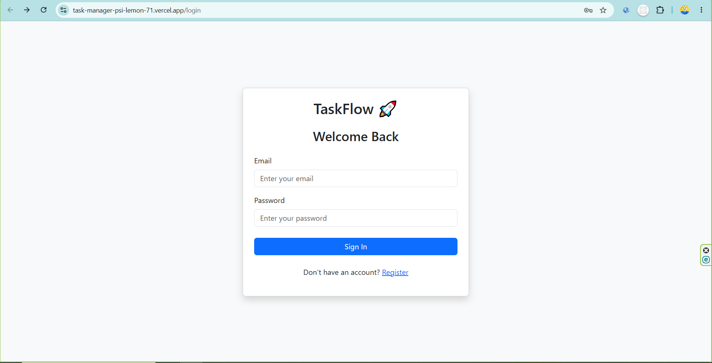
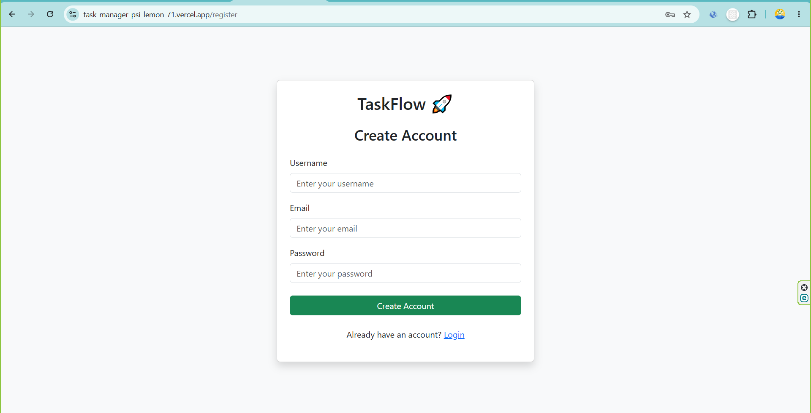
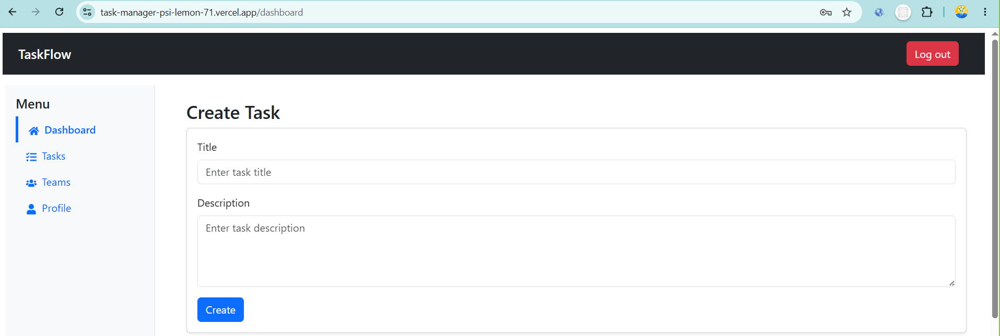
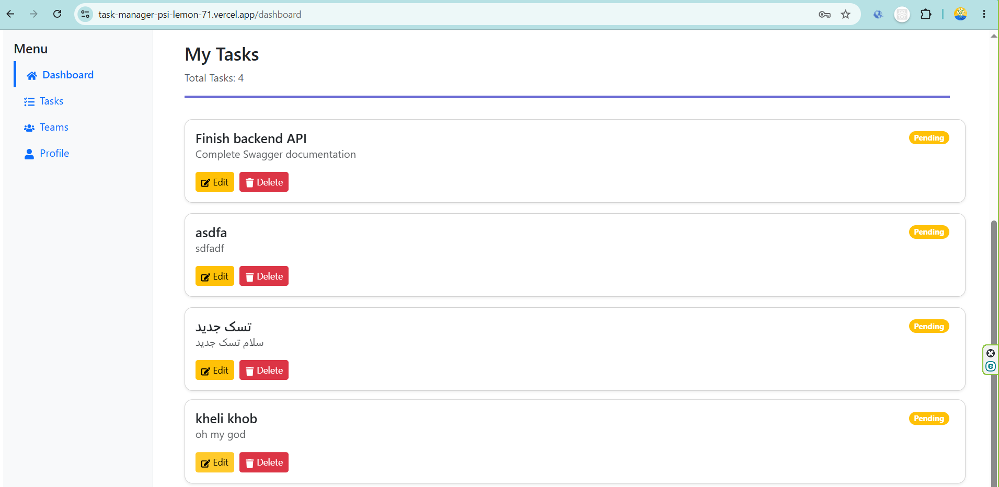
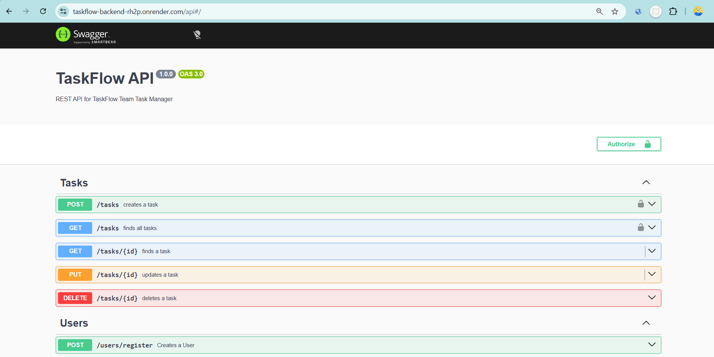

# 🚀 TaskFlow


[](https://task-manager-psi-lemon-71.vercel.app)

A modern full-stack task management application built with React, NestJS, Prisma, and PostgreSQL. TaskFlow provides a secure and scalable environment for managing tasks, collaborating with team members, and tracking progress through a clean and responsive user interface.

> **Project Status**
>
> 🚧 Currently under active development.
>
> ✅ Backend is production-ready.
>
> 🚧 Frontend is in progress.

## 📌 Overview

TaskFlow is a modern full-stack task management application designed to help individuals and teams organize their work efficiently. It provides a simple and intuitive interface for creating, managing, and tracking tasks while promoting collaboration and productivity.

The project follows a client-server architecture, with a React frontend delivering a responsive user experience and a NestJS backend exposing a secure RESTful API. Data is managed through Prisma ORM with PostgreSQL as the primary database, while JWT-based authentication ensures secure access to protected resources.

TaskFlow is being developed as a portfolio project to demonstrate modern full-stack development practices, including scalable architecture, clean code principles, authentication and authorization, API documentation, and deployment to a production environment.

## ✨ Features

- 🔐 **User Authentication** – Secure user registration and login using JWT-based authentication.
- 🛡️ **Authorization** – Protected routes and role-based access control for secure resource management.
- 📋 **Task Management** – Create, read, update, and delete tasks with a clean RESTful API.
- 👥 **Team Collaboration** – Organize users into teams and manage shared tasks.
- ✅ **Data Validation** – Request validation using DTOs and Validation Pipes.
- ⚠️ **Global Error Handling** – Consistent exception handling for reliable API responses.
- 📚 **Swagger Documentation** – Interactive API documentation for testing and exploration.
- 🗄️ **PostgreSQL Database** – Reliable relational database managed with Prisma ORM.
- 🚀 **Production Deployment** – Backend deployed and configured for a production environment.
- 🎨 **Responsive Frontend** – Modern React interface built with Bootstrap and Axios for API communication.

## 🛠️ Tech Stack

### Frontend

- React
- Vite
- Bootstrap
- Axios
- React Router

### Backend

- NestJS
- TypeScript
- Prisma ORM
- JWT Authentication
- Passport.js
- Swagger (OpenAPI)

### Database

- PostgreSQL

### Development Tools

- Git
- GitHub
- Postman
- npm

## 📁 Project Structure

```text
task-manager/
│
├── frontend/                 # React application
│   ├── public/
│   ├── src/
│   ├── package.json
│   └── vite.config.js
│
├── backend/                  # NestJS REST API
│   ├── prisma/
│   ├── src/
│   ├── package.json
│   └── nest-cli.json
│
├── screenshots/              # Application screenshots
│   ├── dashboard.PNG
│   ├── login.PNG
│   ├── register.PNG
│   ├── swagger.PNG
│   └── tasks.PNG
│
└── README.md

```

## 📦 Getting Started

### Prerequisites

Before running this project, make sure you have the following installed:

- Node.js (v20 or later recommended)
- npm
- PostgreSQL
- Git

### Installation

Clone the repository:

```bash
git clone https://github.com/arifrezaie4-dev/task-manager.git
cd task-manager
```

Install frontend dependencies:

```bash
cd frontend
npm install
```

Install backend dependencies:

```bash
cd ../backend
npm install
```

### Environment Variables

Create a `.env` file inside the `backend` directory and configure the following variables:

```env
DATABASE_URL=
JWT_SECRET=
PORT=
```

### Running the Application

Start the backend server:

```bash
cd backend
npm run start:dev
```

Start the frontend:

```bash
cd frontend
npm run dev
```

## 🌐 Live Demo

The application is deployed and available online:

- Frontend: https://task-manager-psi-lemon-71.vercel.app
- Backend API: https://taskflow-backend-rh2p.onrender.com
- Swagger Documentation: https://taskflow-backend-rh2p.onrender.com/api

## 📚 API Documentation

The backend API is documented using Swagger (OpenAPI), making it easy to explore and test available endpoints.

### Local Documentation

Once the backend server is running locally, you can access the API documentation at:

`http://localhost:3000/api`

### Live Backend

The production backend is available at:

* Backend API: https://taskflow-backend-rh2p.onrender.com
* Swagger UI: https://taskflow-backend-rh2p.onrender.com/api

The Swagger interface provides interactive documentation where you can inspect endpoints, request parameters, and API responses directly from your browser.


## 🖼️ Screenshots

### Login Page



### Register Page



### Dashboard



### Tasks Management



### Swagger API Documentation




## 🗺️ Roadmap

### Completed

* [x] Initialize the project structure
* [x] Build the NestJS backend
* [x] Configure PostgreSQL with Prisma ORM
* [x] Implement user authentication with JWT
* [x] Add role-based authorization
* [x] Develop Task CRUD operations
* [x] Create Team management APIs
* [x] Configure Swagger API documentation
* [x] Deploy the backend to Render

## 💡 Future Improvements

The following features are planned for future releases:

* Email verification
* Password reset functionality
* Task deadlines and reminders
* File attachments for tasks
* Real-time notifications
* Activity logs
* Advanced search and filtering
* Dark mode
* Calendar view
* Docker support for easier deployment

## 📄 License

This project is licensed under the MIT License.

See the `LICENSE` file for more information.

## 👨‍💻 Author

**Arif Rezaie**

Junior Full-Stack Developer

* GitHub: https://github.com/arifrezaie4-dev
```
